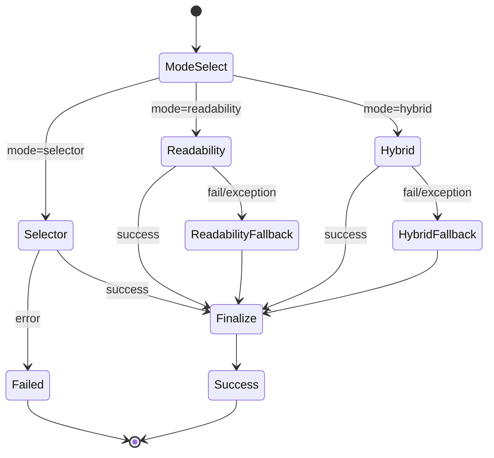
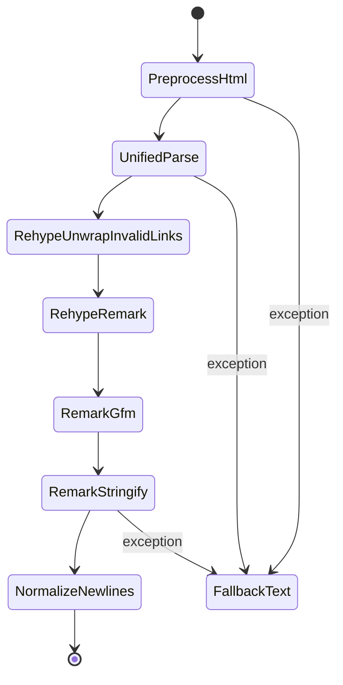
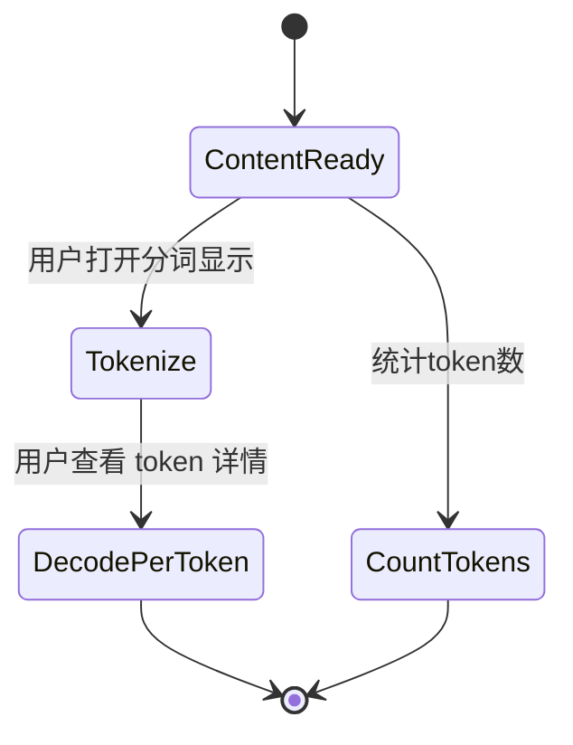

# HTML 解析 / 分词 / 清洗 / unified 转 Markdown 状态机

本文件整理当前代码中的“HTML 解析 → unified 转 Markdown → 清洗 → 分词展示”的状态机流转逻辑，覆盖页面级抓取与元素级抓取两条路径。

## 入口与职责

- 页面级抓取入口：`utils/extractor.ts` 中的 `scrapeWebpageContent()`
- 抓取状态机编排：`utils/pipeline/scrape-machine.ts`（robot3）
- 横切关注点（日志/耗时/错误）：`utils/pipeline/aspects.ts`（AOP）
- 元素级抓取入口：`utils/content-extractor.ts` 中的 `extractContentFromElement()`
- HTML→Markdown：`utils/readability-extractor.ts` → `parser/htmlParser.ts` → `parser/parser.ts`
- HTML 预清洗：`parser/plugins/preprocess-html.ts`
- 清洗（压缩空白/保留标题/保护代码块）：`utils/formatter.ts` 中的 `cleanContent()`
- 分词显示：`components/ContentSection.tsx` + `components/TokenizationDisplay.tsx`

## 状态机总览（页面级抓取：robot3 + AOP）



### 1) ModeSelect（抓取模式）

- `scrapeWebpageContent()` 读取 `ExtractorOptions.mode`，进入三种模式之一：
    - `selector`：只走选择器抓取
    - `readability`：只走 DOMPurify + Readability
    - `hybrid`：先选择器，再 Readability，之后质量评估

### 2) Selector（选择器抓取）

在 `extractArticleContent()` 中按顺序降级：

1. `article` 标签：选取文本最长的 `article`
2. 选择器列表：自定义 → 存储的自定义 → 默认选择器
3. 段落集合：`p` 且长度>30，拼接为 HTML
4. 最后回退：`document.body`

这一步产出的内容已经是 **Markdown**（通过 `convertHtmlToMarkdown()` 完成），并同步提取图片列表。

### 3) Readability（DOMPurify + Readability）

`extractWithReadability()`：

- 先用 DOMPurify 清洗 `body`（禁用脚本/样式/iframe 等，同时保留语义标签与常见属性）。
- 构建一个新的 HTML 文档交给 Readability 解析。
- 如果成功，输出 Readability 的 HTML 内容与元数据。
- 如果失败，`readability` 模式回退到 `selector` 模式（由状态机执行）。

### 4) Hybrid（选择器 + Readability + 质量评估）

`evaluateContentQuality()` 以长度、段落数量、标题数量、HTML 标签密度等打分，选择更优的内容。

### 5) Finalize（统一收尾）

- `cleanContent()` 生成 `cleanedContent`
- 如无图片列表，则从最终 Markdown 解析图片
- 输出稳定的 `ScrapedContent` 形状

### 6) AOP 切面（横切关注点）

- `withAspects()` 为每个阶段包裹日志/耗时/错误处理
- 状态机只关心“阶段与转移”，细节由切面收束

## HTML → Markdown 转换状态机（unified）



### 1) PreprocessHtml

`preprocessHtml()` 做两件事：

- **清理不需要的标签**：`script/style/noscript/svg/meta/link` + plasmo 注入节点
- **补全图片链接**：若有 `baseUrl`，把 `img[src]` 解析为绝对 URL

浏览器环境用 `DOMParser` 处理；Node 环境用正则做轻量清理。

### 2) UnifiedParse + Rehype/Remark 链

`getParser()` 组成 unified pipeline：

1. `rehype-parse`（`fragment: true`）解析 HTML
2. `rehypeUnwrapInvalidLinks` 去除无效链接包裹
3. `rehype-remark` + `heading-handlers` 保留标题层级
4. `remark-gfm` 支持 GFM
5. `remark-stringify` 输出 Markdown（统一 `bullet/emphasis/strong` 风格）

### 3) NormalizeNewlines（转换后清理）

`convertHtmlToMarkdown()` 在成功时进行轻度清理：

- 连续换行不超过 2 行
- `trim()` 去除首尾空白

### 4) FallbackText（转换失败回退）

若 unified 转换失败：

- 直接去掉 HTML 标签
- 合并多余空白
- 作为纯文本返回

## 清洗（cleanContent）状态机

`cleanContent()` 用于生成压缩后的 `cleanedContent`：

1. **提取代码块**：用占位符保护 ```...``` 内容
2. **压缩空白**：合并空格/换行，修复标点周围空格
3. **保留 Markdown 标题格式**：`#` 至 `######`
4. **恢复代码块**：把占位符替换回原始代码块

该步骤在 `scrapeWebpageContent()` 的 `Finalize` 阶段统一执行。

## 分词（Tokenization）状态机



### 1) CountTokens

- `ContentSection` 使用 `countTokens(currentContent)` 计算 token 数量
- `currentContent` 可来自原始 Markdown 或 `cleanedContent`

### 2) Tokenize / DecodePerToken

- `TokenizationDisplay` 在可见时对内容 `encode()`
- 若显示详情，则逐 token `decode()` 生成文本片段

## 元素级抓取（用于选区提取）

`extractContentFromElement()`：

1. `html = element.outerHTML`
2. `text = extractFormattedText(element)`（智能提取纯文本）
3. `markdown = convertHtmlToMarkdown(html, element.baseURI)`
4. 失败时回退为 `text`

`createScrapedDataFromExtraction()` 将其映射为 `ScrapedContent`，供 UI/AI 复用。

## 关键文件索引

- 抓取与流程控制：`utils/extractor.ts`
- 状态机编排：`utils/pipeline/scrape-machine.ts`
- AOP 切面：`utils/pipeline/aspects.ts`
- Readability + HTML→Markdown：`utils/readability-extractor.ts`
- unified pipeline：`parser/parser.ts`
- HTML 预清洗：`parser/plugins/preprocess-html.ts`
- 内容清洗：`utils/formatter.ts`
- 分词展示：`components/ContentSection.tsx`, `components/TokenizationDisplay.tsx`
- 元素级提取：`utils/content-extractor.ts`
